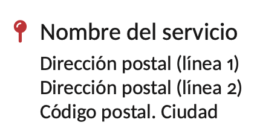

# Clase `UGR-beamer`

La clase `UGR-beamer` es una personalización de la clase `beamer` para adaptarla a la imagen institucional de la Universidad de Granada. No existe una plantilla *oficial* para transparencias pero sí existen varios documentos sobre los que hemos basado el diseño:

- 

## Opciones y particularidades de la clase


Al ser una extensión de la clase `beamer`, La clase `UGR-beamer` admite cualquier opción de la primera y además:

- 

Si usamos el comando `\section` para estructurar nuestra presentación se insertará una transparencia con fondo gris con el título de la sección.

## Paquetes cargados por defecto en la clase

La clase hace uso de los siguientes paquetes para su diseño general y no es necesario cargarlos de nuevo en el documento

- [fontawesome7](https://texdoc.org/serve/fontawesome7): proporciona soporte para la fuente de iconos *font awesome 7*.

## Entornos y comandos definidos por la propia clase

### Entorno `iconBlock`

Permite añadir un entorno con un icono asociado:



La sintaxis es la siguiente

```tex
\begin{iconBlock}{\faMapPin}{Nombre del servicio}
  \small
  Dirección postal (línea 1)\\
  Dirección postal (línea 2)\\
  Código postal. Ciudad
\end{iconBlock}
```

## ¿Cómo personalizar el título? 

Los siguientes comandos permiten personalizar los datos que aparecen en la transparencia de título: 

- `\title{Título de la presentación}`
- `\subtitle{Posible subtítulo}`
- `\author{Autor}`
- `\date{Fecha}`
- `\event{Congreso/Seminario/Asignatura/Reunión}`
- `\place{Granada (España)}`
- `\collaborators{Listado de colaboradores}`
- `\fundings{Información sobre financiación}`

Ver el preámbulo de [`beamer.tex`](beamer.tex).

## Presentación de ejemplo
Ver ejemplo [`beamer.tex`](beamer.tex)

## Preguntas frecuentes

- ¿Cómo añado referencias a una presentación con beamer?

Podemos usar las capacidades de LaTeX para incluir referencias en nuestras presentaciones. La mejor forma es añadir el siguiente `frame` al final del documento. 

```tex
\begin{frame}[plain, allowframebreaks]
  \frametitle{Referencias}
  %\addcontentsline{toc}{section}{Referencias}
  % REFERENCIAS
  % Añadimos las referencias con el entorno thebibliography o usando bibtex
\end{frame}
```

Las opciones `plain` y `allowframebreaks` permiten que el contenido de la misma se expanda al número necesario de transparencias para que todas las referencias puedan mostrarse adecuadamente.

Si estamos familiarizados con `bibtex` y tenemos una base de datos bibliográfica en un fichero `bib` basta copiar dicho fichero en la carpeta donde se encuentre nuestro fichero `.tex` principal y añadir:

```tex
\begin{frame}[plain, allowframebreaks]
  \frametitle{Referencias}
  %\addcontentsline{toc}{section}{Referencias}
  % REFERENCIAS
  \bibliographystyle{apalike2}
  \bibliography{library}
\end{frame}
```


## Acerca del diseño
